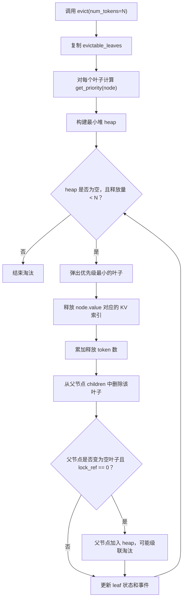

# RadixCache 机制精读笔记

上游版本基线：

- SGLang tag：`v0.5.14`
- 源码 commit：`49e384ce9d304648e9959666ecb8ce8cd98d0deb`
- 本地 vendor 路径：`vendor/sglang/srt/mem_cache/`

## TreeNode 状态

`TreeNode` 定义在 `radix_cache.py` 中，是 RadixCache 的基本树节点。

关键字段：

- `children`：子节点表，key 是子边的第一个 token/page key。
- `parent`：父节点指针。
- `key`：当前边代表的 token 片段。
- `value`：当前边对应的 KV cache 索引；如果是 `None`，表示节点已被淘汰。
- `lock_ref`：请求或存储操作的保护引用计数；`lock_ref > 0` 的节点不可淘汰。
- `last_access_time`：最近访问时间，在 prefix match 和 insert 遍历时更新。
- `creation_time`：节点创建时间，只在节点创建时设置，供 FIFO/FILO 使用。
- `hit_count`：命中次数，在 insert 遍历已有节点或创建新节点时递增；chunked 场景会跳过，避免自引用请求虚增命中。
- `hash_value`：按 page 懒计算的哈希，用于 KV cache event。
- `priority`：请求优先级，insert 时沿路径传播，供 priority eviction 使用。

根节点比较特殊：

- `key` 和 `value` 为空；
- `lock_ref = 1`，天然受保护；
- `priority` 初始化为极小值；
- 不会进入可淘汰集合。

## match_prefix 流程

入口：`RadixCache.match_prefix`。

流程：

1. 如果启用 EAGLE bigram 模式，先把 key 转成 bigram view。
2. 如果 cache 被禁用，或 key 为空，直接返回空匹配结果。
3. 按 `page_size` 对齐 key。
4. 调用 `_match_prefix_helper(root, key)`。
5. 将匹配到的多个节点 `value` 拼接成 `device_indices`。

`_match_prefix_helper` 会更新 root 和沿途 child 的 `last_access_time`。如果一次查询只匹配到某个子边的中间位置，会调用 `_split_node` 把这个中间前缀切成显式节点。这样以后同样的前缀能直接停在这个节点上，也让共享前缀成为内部节点。

这一点很重要：一次查询不只是读操作，也可能改变树结构。

## insert 流程

入口：`RadixCache.insert`。

关键行为：

- `priority` 缺省为 0。
- 沿途节点更新 `last_access_time`。
- `priority` 沿路径用 `max(existing, new_priority)` 传播。
- 已存在的匹配节点会增加 `hit_count`，chunked 请求除外。
- 如果插入时需要 split，新的父节点会继承原 child 的 `priority`、`hit_count`、`lock_ref`，并拿走前缀部分的 `value/hash_value`。
- 如果遍历结束后还有剩余 key，就创建一个新叶子，并执行 `evictable_size_ += len(key)`。

淘汰和容量统计的单位是 token 数，不是节点数。也就是说，一个长叶子节点被淘汰可能释放大量 token，而一个短叶子只释放很少 token。后续做策略比较时，命中率和淘汰效果都应该用 token 口径理解，而不是“淘汰了几个节点”。

## evict 流程

入口：`RadixCache.evict(EvictParams(num_tokens=N))`。

流程：

1. 复制当前 `evictable_leaves` 集合。
2. 对每个叶子计算 `(eviction_strategy.get_priority(node), node)`，建立 heap。
3. 从 heap 中弹出优先级最小的叶子。
4. 调用 `token_to_kv_pool_allocator.free(x.value)` 释放 KV 索引。
5. `num_evicted += len(x.value)`。
6. 从父节点中删除这个叶子。
7. 如果父节点因此没有子节点，且 `lock_ref == 0`，父节点会级联进入 heap。
8. 如果启用了 event，记录 remove event。
9. 直到释放 token 数达到请求量，或 heap 为空。

流程图：

核心约束：RadixCache 只淘汰叶子。内部节点只要仍有未淘汰子节点，就天然受子树保护。一个热门共享前缀即使最近没被直接访问，也可能因为它是内部节点而留在缓存里。

## evictable_leaves 如何维护

`_update_leaf_status(node)` 维护 `evictable_leaves`：

- 如果 `node.evicted`，或者 `node.lock_ref > 0`，从 `evictable_leaves` 移除。
- 如果存在任何未淘汰 child，说明它是内部节点，也从 `evictable_leaves` 移除。
- 否则，它是活着、未加锁、无子节点的叶子，可以加入可淘汰集合。

所以所有策略实际比较的对象不是整棵树，而是“当前可淘汰叶子集合”。更准确地说，上游策略都是“叶子上的 LRU/LFU/FIFO/SLRU/...”，不是全树策略。

## lock_ref 保护机制

`inc_lock_ref(node)` 从当前节点一路走到 root：

- 如果某个节点从 `lock_ref == 0` 变为受保护，就执行：
  - `evictable_size_ -= len(node.key)`
  - `protected_size_ += len(node.key)`
- 然后 `node.lock_ref += 1`。
- 每个节点都会刷新 leaf 状态。

`dec_lock_ref(node)` 做相反动作：

- 如果某个节点从 `lock_ref == 1` 变为未保护，就执行：
  - `evictable_size_ += len(node.key)`
  - `protected_size_ -= len(node.key)`
- 然后 `node.lock_ref -= 1`。
- 每个节点也会刷新 leaf 状态。

这意味着真机实验和离线模拟器可能有偏差：并发请求会临时保护一批节点，让“真实可淘汰池”比离线顺序 replay 想象的小。

## 内置淘汰策略

所有内置策略都继承 `EvictionStrategy`，并实现 `get_priority(node)`。heap 会优先弹出 priority 最小的节点。

| 策略 | priority | 含义 |
|---|---|---|
| LRU | `last_access_time` | 最久未访问的叶子先淘汰 |
| LFU | `(hit_count, last_access_time)` | 命中次数最低者先淘汰，LRU 打破平局 |
| FIFO | `creation_time` | 最早创建的叶子先淘汰 |
| MRU | `-last_access_time` | 最近访问的叶子先淘汰 |
| FILO | `-creation_time` | 最新创建的叶子先淘汰 |
| Priority | `(priority, last_access_time)` | 低优先级先淘汰，LRU 打破平局 |
| SLRU | `(is_protected, last_access_time)` | `hit_count >= 2` 的节点进入保护段，试用段优先被淘汰 |

一个重要细节：heap 是每次调用 `evict()` 时基于当前叶子集合临时构建的，不是全程维护的动态 heap。对于这些无状态 priority 函数来说这没问题，但这也说明当前接口比较窄。

## CLI 与策略注入路径

策略注入路径：

`server_args.radix_eviction_policy` -> `kv_cache_builder.py` -> `CacheInitParams.eviction_policy` -> `RadixCache.__init__` -> `get_eviction_strategy(policy)`。

在 `v0.5.14` 里观察到：

- `evict_policy.py` 定义了 7 个策略类。
- `utils.py` 的策略工厂注册了 7 个策略：`lru`、`lfu`、`fifo`、`mru`、`filo`、`priority`、`slru`。
- 但 `server_args.py` 默认 CLI choices 只列了：`lru`、`lfu`、`slru`、`priority`。

因此这个 tag 下更准确的说法是：代码层有 7 种策略工厂，但默认命令行不一定暴露全部策略。后续 GPU 实验如果要跑 FIFO/MRU/FILO，可能需要额外注册 CLI choice，或者做一个很小的 patch。

## 为什么 get_priority 表达不了完整 2Q

`get_priority(node)` 是一个无状态打分函数。它只看单个 node，返回一个可比较的 priority。

完整 2Q 需要维护状态和事件：

- A1in：FIFO 试用队列，有 token 配额。
- A1out：幽灵队列，只记录最近被淘汰 key 的历史，不持有 KV。
- Am：主 LRU 区，存放通过二次访问验证的热点。

缺失的关键事件包括：

- on hit：命中时判断是否从 A1out/A1in 晋升到 Am。
- on insert：新 key 应该进入 A1in，还是因为命中过 ghost history 直接进入 Am。
- on eviction：从 A1in 淘汰出去的 key 要写进 A1out。
- on split：节点分裂后，新暴露的前缀节点应该如何继承或派生 2Q 状态。

这些都不是一个单节点 priority 函数能表达的。所以扩展 eviction event hook 是实现完整 2Q 的工程依据。

## 对负载设计的推论

因为只能淘汰叶子，所以策略差异会强烈依赖树形态。

预测：

- 浅而宽、共享头部明显的树，例如 few-shot 评测中大量请求复用公共 prompt 前缀，策略差异应该较小。共享前缀会变成内部节点，被结构性保护。
- 深而窄、相互独立的树，例如多轮对话，更多决策发生在叶子层，近期性策略会更有价值。
- 频率倾斜的多租户 system prompt 场景，应该更有利于 LFU 或 2Q，因为热门租户会反复出现。
- 扫描污染场景应该是 2Q 最有优势的场景。一次性长文档请求会先进入 A1in/A1out 试用通道，不应轻易冲掉 Am 中已经验证过的热点。

这个推论会指导 W1-W4 trace 设计，最后也应该通过树形态统计来验证，例如平均深度、分支因子、叶子 token 分布等。
